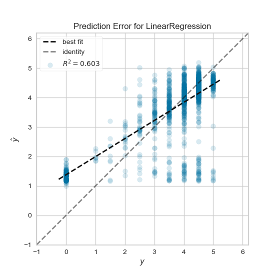
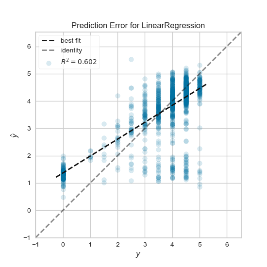
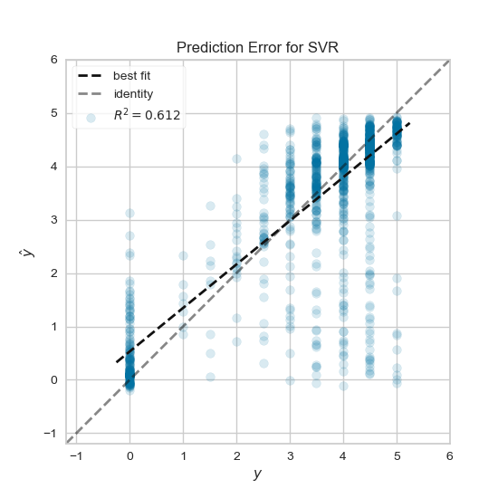

# Mobile App Store data analysis

On this project I tried to analyze [Mobile App Store](https://www.kaggle.com/ramamet4/app-store-apple-data-set-10k-apps) dataset and build regression models using sklearn to predict user rating for the app.

## Download Dataset

Download the dataset from [here](https://www.kaggle.com/ramamet4/app-store-apple-data-set-10k-apps) and place it in "datasets" directory.

## Data Preparation

First column (app number on the csv file) is dropped in addition to some columns that do not contain useful information that can be used on the prediction.

* Id, track_name: these columns are dropped because the id and name are not important factors that affect the final user rating.
* currency, vpp_lic: these columns are dropped because they nearly have the same values over the dataset, so they are not helping in the prediction.
* ver: this column is dropped because there is no direct relation between the rating and the application version.
After dropping the useless columns that won’t be used, the rows that have missing values are dropped. The remaining columns are normalized before using them later on the model so features values will range from 0 to 1 which means all features are participating in the same level to predict the final rating, that helps the model to learn quickly. The normalized columns are size_bytes, price, rating_count_tot, rating_count_ver, user_rating_ver, sup_devices.num, ipadSc_urls.num, and lang.num.
One hot encoding is used to represent the categorical features cont_rating and prime_genre:
* cont_rating: this column has 4 unique categories, so applying onehotencoder to this column gives a new 4 columns, these 4 new columns are joined to the original data frame and cont_rating column is dropped after that.
* prime_genre: this column has 23 unique categories, onehotencoder is applied to this column the same way for cont_rating.
Bonus: to provide an extra feature; appleStore_description.csv dataset is used to count the number of words on application description field and join this extra feature to the original dataset.

## Data Visualization

The correlation between user_rating and the other features is calculated, the figure below shows the significant features that have correlation larger than 0.1

## 1st Model

On the first model linear regression is used.
Model is fitted with the significant features that have correlation larger than 0.1 (9 features), and gives us mean absolute error ≈ 0.63, R2 ≈ 0.603, and took about 0.137 seconds to fit.
The below figure shows the prediction error for the model.

The model is also fitted with all features after OneHotEncoding (36 features), and gives us mean absolute error ≈ 0.634, R2 ≈ 0.602, and took about 0.033 seconds to fit.
The below figure shows the prediction error for the model.

## 2nd Model

For the second model Support Vector Regression is used with rbf kernel.
Model is fitted with the significant features that have correlation larger than 0.1 (9 features), and gives us mean absolute error ≈ 0.5, R2 ≈ 0.602, and took about 2.48 seconds to fit.
The below figure shows the prediction error for the model.

The model is also fitted with all features after OneHotEncoding (36 features), and gives us mean absolute error ≈ 0.5, R2 ≈ 0.612, and took about 2.07 seconds to fit.
The below figure shows the prediction error for the model.

## Conclusion

* Support Vector Regression model is predicting a better result compared to the linear regression model.
* Linear regression model seems to be biased model and predicts all apps that has 0 user rating with around 1.2 user rating.
* This problem can be predicted using different regression models and it could achieve better accuracy with more training data and additional informative features.
