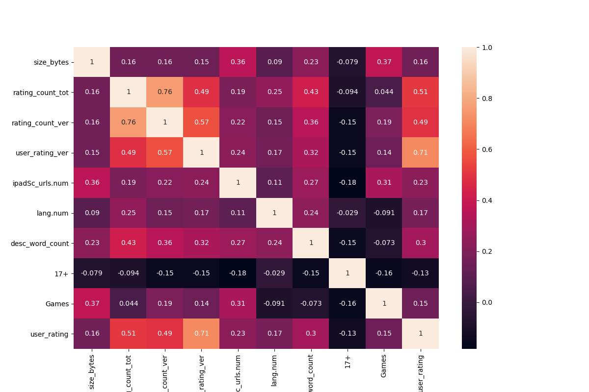
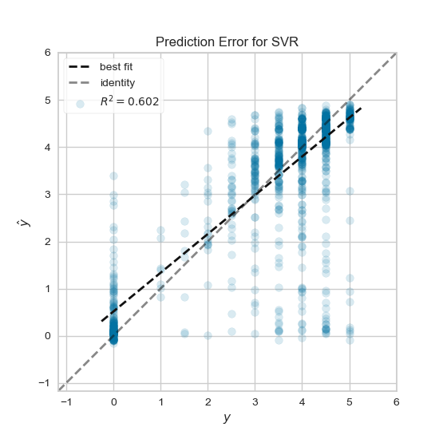

# Mobile App Store data analysis

On this project i tried to analyse [Mobile App Store](https://www.kaggle.com/ramamet4/app-store-apple-data-set-10k-apps) dataset and build regression models using sklearn to predict user rating for the app.

## Download Dataset

Download the dataset from [here](https://www.kaggle.com/ramamet4/app-store-apple-data-set-10k-apps), and place it on "datasets" directory.

## Data Preparation

First, we will drop first column (app number on the csv file) and some columns that does not have useful information that we can use on our prediction.

* Id, track_name: we will drop these columns because the id and name are not important factors that affect the final user rating.
* currency, vpp_lic: we will drop these columns because they nearly have the same values over the dataset, so they are not helping in the prediction.
* ver: we will drop this column because there is no direct relation between the rating and the application version.
After we dropped the columns that we will not use, we will remove the rows that have missing values and then normalize the columns that we will use later on our model so features values will range from 0 to 1 which means all features are participating in the same level to predict the final rating, that helps our model to learn quickly. The normalized columns are size_bytes, price, rating_count_tot, rating_count_ver, user_rating_ver, sup_devices.num, ipadSc_urls.num, and lang.num.
Then we will use one hot encoding to represent our categorical features cont_rating and prime_genre
* cont_rating: this column has 4 unique categories, so applying onehotencoder to this column would give us 4 new columns, we will join these 4 new columns to our original dataframe and drop cont_rating column since we do not need it anymore.
* prime_genre: this column has 23 unique categories, we will apply onehotencoder to this column the same way we did for cont_rating.
Bonus: to provide an extra feature we used appleStore_description.csv dataset to count the number of words on application description and normalize it then join the normalized values to the original dataset.

## Data Visualization

The correlation between user_rating and the other features is calculated, the figure below shows the significant features that have correlation larger than 0.1

## 1st Model

On the first model linear regression is used.
Model is fitted with the significant features that have correlation larger than 0.1 (9 features), and gives us mean absolute error ≈ 0.63, R2 ≈ 0.603, and took about 0.137 seconds to fit.
The below figure shows the prediction error for the model.

The model is also fitted with all features after OneHotEncoding (36 features), and gives us mean absolute error ≈ 0.634, R2 ≈ 0.602, and took about 0.033 seconds to fit.
The below figure shows the prediction error for the model.

## 2nd Model

For the second model Support Vector Regression is used with rbf kernel.
Model is fitted with the significant features that have correlation larger than 0.1 (9 features), and gives us mean absolute error ≈ 0.5, R2 ≈ 0.602, and took about 2.48 seconds to fit.
The below figure shows the prediction error for the model.

The model is also fitted with all features after OneHotEncoding (36 features), and gives us mean absolute error ≈ 0.5, R2 ≈ 0.612, and took about 2.07 seconds to fit.
The below figure shows the prediction error for the model.

## Conclusion

* Support Vector Regression model is predicting a better result compared to the linear regression model.
* Linear regression model seems to be biased model and predicts all apps that has 0 user rating with around 1.2 user rating.
* This problem can be predicted using different regression models and it could achieve better accuracy with more training data and additional informative features.
